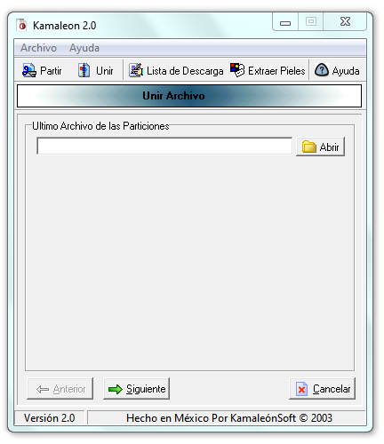
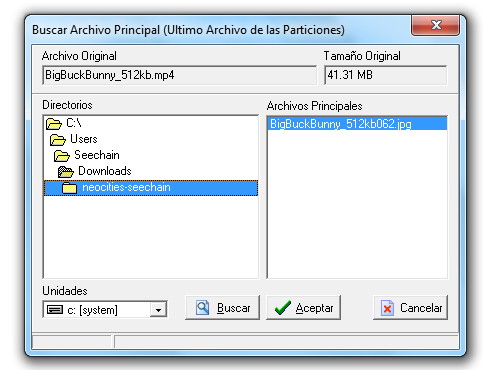
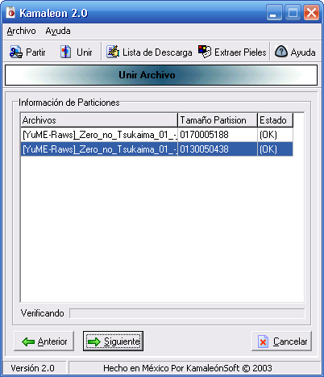
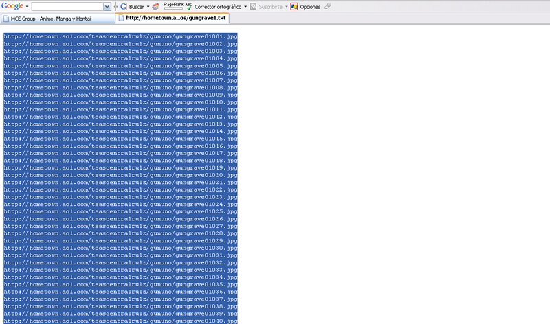
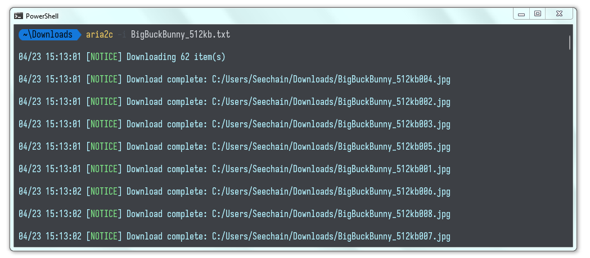

# Kamaleon 2: Download by Lists - A 2000s Download Method

[Español](README.md) | [English]

This repository documents and preserves knowledge about **Kamaleon 2**, a tool used in the 2000s for managing, splitting, and camouflaging large files.

> **⚠️ Note:** The software interface, as well as the original help documentation included in this repository, are in **Spanish**.

## What was Kamaleon 2?

In an era where cloud storage services were limited and connection speeds were low, Kamaleon allowed users to:
1. **Split large files**: Divide files into smaller chunks (e.g., 1.44MB for floppy disks or custom sizes for hosting servers).
2. **Camouflage (Skins)**: Disguise file parts as other file types (commonly `.jpg` images) to bypass content filters or for discretion.
3. **List Generation**: Create `.lst` or `.txt` files with download URLs to be processed by download managers.

## Repository Content

- `kamaleon2.zip`: Compressed file containing the original executable program.
- `Ayuda`: Contains the original help tutorial files in Spanish (HTML and images).
- `Ejemplo`: Practical example.

---

# Usage Guide 

This guide details the main processes of Kamaleon 2 based on its original documentation.

## 1. Splitting a File (Partir)
The splitting process allows you to divide a large file into smaller parts.

1. **Selection**: Press the "Archivo Origen" (Source File) button and select the file to process.
2. **Security**: Optionally, you can set a password for later joining.
3. **Partition Type**:
   - **Fijas (Fixed)**: Specify the exact size in Bytes.
   - **Aleatorias (Random)**: Define a range (min/max) so each part has a different size.
4. **Camouflage (Pieles/Skins)**:
   - "Skins" can be used so that the partitions look like normal files (like images).
   - Kamaleon embeds the real information within these facade files.
5. **Name Format**: You can choose a base name or generate random names for the parts.

## 2. Joining a File (Unir)
To recover the original file:

1. **Location**: It is essential to find the **Last File** of the partition series. This "Main" file contains the metadata at the end of its structure.

2. **Verification**: The program will perform a thorough check to confirm that all parts are present and not corrupted.

3. **Destination**: Select the folder where the original file will be reconstructed.

## 3. Generating a Download List
Useful for sharing files hosted on web servers.

1. **Load Metadata**: Select the last file of the partitions already uploaded.
2. **Configure URL**: Enter the base URL of the server (e.g., `http://mysite.com/files/`).
3. **Ranges**: If files are on different servers, multiple addresses and part ranges can be configured.
4. **Final File**: A `.lst` or `.txt` file is generated, compatible with most download managers.

## Download Managers
Historically, programs like FlashGet or GetRight were used. Currently, it is recommended to use:
- **[JDownloader 2](https://jdownloader.org/)**: Supports importing link lists and facilitates batch downloads.
- **[aria2](https://aria2.github.io/)**: A lightweight multi-protocol & multi-source command-line download utility.

## Compatibility and Requirements
Kamaleon 2 is legacy software originally designed for Windows XP and 7. However:
- **Windows 10**: It has been successfully tested on **Windows 10 LTSC 21H2 (Build 19044.6456)**.
- **Linux**: Using **Wine** is recommended to run the `kamaleon2.zip` binary.
- **Others**: On modern Windows systems, if you experience errors, try running the program in "Compatibility mode for Windows XP (Service Pack 3)".

---

## Practical Example: Big Buck Bunny
For this practical example, the **public domain** short film (Creative Commons license) **Big Buck Bunny** has been used. This file has been processed following this procedure:

1. **Partitioning**: The original video has been split into multiple small parts.
2. **Camouflage**: Each part has been "camouflaged" using images (Skins) to demonstrate how the real content was hidden.

### Example Download Links
You can copy the following list of links to use in your download manager (such as JDownloader):

<pre>
https://raw.githubusercontent.com/Seechain/kamaleon2/main/Ejemplo/BigBuckBunny_512kb001.jpg
https://raw.githubusercontent.com/Seechain/kamaleon2/main/Ejemplo/BigBuckBunny_512kb002.jpg
https://raw.githubusercontent.com/Seechain/kamaleon2/main/Ejemplo/BigBuckBunny_512kb003.jpg
https://raw.githubusercontent.com/Seechain/kamaleon2/main/Ejemplo/BigBuckBunny_512kb004.jpg
https://raw.githubusercontent.com/Seechain/kamaleon2/main/Ejemplo/BigBuckBunny_512kb005.jpg
https://raw.githubusercontent.com/Seechain/kamaleon2/main/Ejemplo/BigBuckBunny_512kb006.jpg
https://raw.githubusercontent.com/Seechain/kamaleon2/main/Ejemplo/BigBuckBunny_512kb007.jpg
https://raw.githubusercontent.com/Seechain/kamaleon2/main/Ejemplo/BigBuckBunny_512kb008.jpg
https://raw.githubusercontent.com/Seechain/kamaleon2/main/Ejemplo/BigBuckBunny_512kb009.jpg
https://raw.githubusercontent.com/Seechain/kamaleon2/main/Ejemplo/BigBuckBunny_512kb010.jpg
https://raw.githubusercontent.com/Seechain/kamaleon2/main/Ejemplo/BigBuckBunny_512kb011.jpg
https://raw.githubusercontent.com/Seechain/kamaleon2/main/Ejemplo/BigBuckBunny_512kb012.jpg
https://raw.githubusercontent.com/Seechain/kamaleon2/main/Ejemplo/BigBuckBunny_512kb013.jpg
https://raw.githubusercontent.com/Seechain/kamaleon2/main/Ejemplo/BigBuckBunny_512kb014.jpg
https://raw.githubusercontent.com/Seechain/kamaleon2/main/Ejemplo/BigBuckBunny_512kb015.jpg
https://raw.githubusercontent.com/Seechain/kamaleon2/main/Ejemplo/BigBuckBunny_512kb016.jpg
https://raw.githubusercontent.com/Seechain/kamaleon2/main/Ejemplo/BigBuckBunny_512kb017.jpg
https://raw.githubusercontent.com/Seechain/kamaleon2/main/Ejemplo/BigBuckBunny_512kb018.jpg
https://raw.githubusercontent.com/Seechain/kamaleon2/main/Ejemplo/BigBuckBunny_512kb019.jpg
https://raw.githubusercontent.com/Seechain/kamaleon2/main/Ejemplo/BigBuckBunny_512kb020.jpg
https://raw.githubusercontent.com/Seechain/kamaleon2/main/Ejemplo/BigBuckBunny_512kb021.jpg
https://raw.githubusercontent.com/Seechain/kamaleon2/main/Ejemplo/BigBuckBunny_512kb022.jpg
https://raw.githubusercontent.com/Seechain/kamaleon2/main/Ejemplo/BigBuckBunny_512kb023.jpg
https://raw.githubusercontent.com/Seechain/kamaleon2/main/Ejemplo/BigBuckBunny_512kb024.jpg
https://raw.githubusercontent.com/Seechain/kamaleon2/main/Ejemplo/BigBuckBunny_512kb025.jpg
https://raw.githubusercontent.com/Seechain/kamaleon2/main/Ejemplo/BigBuckBunny_512kb026.jpg
https://raw.githubusercontent.com/Seechain/kamaleon2/main/Ejemplo/BigBuckBunny_512kb027.jpg
https://raw.githubusercontent.com/Seechain/kamaleon2/main/Ejemplo/BigBuckBunny_512kb028.jpg
https://raw.githubusercontent.com/Seechain/kamaleon2/main/Ejemplo/BigBuckBunny_512kb029.jpg
https://raw.githubusercontent.com/Seechain/kamaleon2/main/Ejemplo/BigBuckBunny_512kb030.jpg
https://raw.githubusercontent.com/Seechain/kamaleon2/main/Ejemplo/BigBuckBunny_512kb031.jpg
https://raw.githubusercontent.com/Seechain/kamaleon2/main/Ejemplo/BigBuckBunny_512kb032.jpg
https://raw.githubusercontent.com/Seechain/kamaleon2/main/Ejemplo/BigBuckBunny_512kb033.jpg
https://raw.githubusercontent.com/Seechain/kamaleon2/main/Ejemplo/BigBuckBunny_512kb034.jpg
https://raw.githubusercontent.com/Seechain/kamaleon2/main/Ejemplo/BigBuckBunny_512kb035.jpg
https://raw.githubusercontent.com/Seechain/kamaleon2/main/Ejemplo/BigBuckBunny_512kb036.jpg
https://raw.githubusercontent.com/Seechain/kamaleon2/main/Ejemplo/BigBuckBunny_512kb037.jpg
https://raw.githubusercontent.com/Seechain/kamaleon2/main/Ejemplo/BigBuckBunny_512kb038.jpg
https://raw.githubusercontent.com/Seechain/kamaleon2/main/Ejemplo/BigBuckBunny_512kb039.jpg
https://raw.githubusercontent.com/Seechain/kamaleon2/main/Ejemplo/BigBuckBunny_512kb040.jpg
https://raw.githubusercontent.com/Seechain/kamaleon2/main/Ejemplo/BigBuckBunny_512kb041.jpg
https://raw.githubusercontent.com/Seechain/kamaleon2/main/Ejemplo/BigBuckBunny_512kb042.jpg
https://raw.githubusercontent.com/Seechain/kamaleon2/main/Ejemplo/BigBuckBunny_512kb043.jpg
https://raw.githubusercontent.com/Seechain/kamaleon2/main/Ejemplo/BigBuckBunny_512kb044.jpg
https://raw.githubusercontent.com/Seechain/kamaleon2/main/Ejemplo/BigBuckBunny_512kb045.jpg
https://raw.githubusercontent.com/Seechain/kamaleon2/main/Ejemplo/BigBuckBunny_512kb046.jpg
https://raw.githubusercontent.com/Seechain/kamaleon2/main/Ejemplo/BigBuckBunny_512kb047.jpg
https://raw.githubusercontent.com/Seechain/kamaleon2/main/Ejemplo/BigBuckBunny_512kb048.jpg
https://raw.githubusercontent.com/Seechain/kamaleon2/main/Ejemplo/BigBuckBunny_512kb049.jpg
https://raw.githubusercontent.com/Seechain/kamaleon2/main/Ejemplo/BigBuckBunny_512kb050.jpg
https://raw.githubusercontent.com/Seechain/kamaleon2/main/Ejemplo/BigBuckBunny_512kb051.jpg
https://raw.githubusercontent.com/Seechain/kamaleon2/main/Ejemplo/BigBuckBunny_512kb052.jpg
https://raw.githubusercontent.com/Seechain/kamaleon2/main/Ejemplo/BigBuckBunny_512kb053.jpg
https://raw.githubusercontent.com/Seechain/kamaleon2/main/Ejemplo/BigBuckBunny_512kb054.jpg
https://raw.githubusercontent.com/Seechain/kamaleon2/main/Ejemplo/BigBuckBunny_512kb055.jpg
https://raw.githubusercontent.com/Seechain/kamaleon2/main/Ejemplo/BigBuckBunny_512kb056.jpg
https://raw.githubusercontent.com/Seechain/kamaleon2/main/Ejemplo/BigBuckBunny_512kb057.jpg
https://raw.githubusercontent.com/Seechain/kamaleon2/main/Ejemplo/BigBuckBunny_512kb058.jpg
https://raw.githubusercontent.com/Seechain/kamaleon2/main/Ejemplo/BigBuckBunny_512kb059.jpg
https://raw.githubusercontent.com/Seechain/kamaleon2/main/Ejemplo/BigBuckBunny_512kb060.jpg
https://raw.githubusercontent.com/Seechain/kamaleon2/main/Ejemplo/BigBuckBunny_512kb061.jpg
https://raw.githubusercontent.com/Seechain/kamaleon2/main/Ejemplo/BigBuckBunny_512kb062.jpg
</pre>

You can also download the list files directly:
- [BigBuckBunny_512kb.txt](BigBuckBunny_512kb.txt)
- [BigBuckBunny_512kb.lst](BigBuckBunny_512kb.lst)
