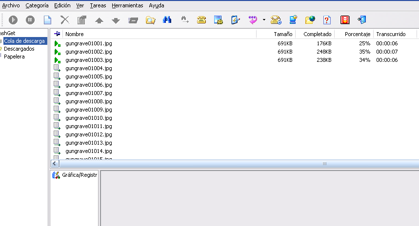
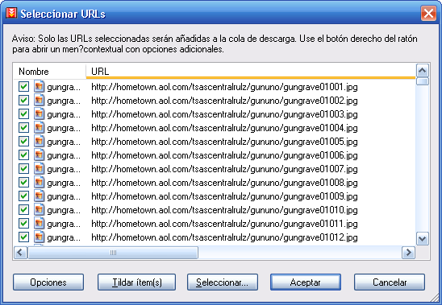

# Kamaleon 2: Documentación de un Método de Descarga de los 2000s

Este repositorio tiene como objetivo documentar y preservar el conocimiento sobre el uso de **Kamaleon 2**, una herramienta icónica de la década de los 2000 utilizada para la gestión, partición y camuflaje de archivos grandes.

## ¿Qué era Kamaleon 2?

En una era donde los servicios de almacenamiento en la nube eran limitados y las velocidades de conexión eran bajas, Kamaleon permitía a los usuarios:
1. **Partir archivos grandes**: Dividir archivos en trozos más pequeños (ej. 1.44MB para disquetes o tamaños personalizados para servidores de hosting).
2. **Camuflaje (Pieles)**: Disfrazar las partes de un archivo como si fueran otros tipos de archivos (comúnmente imágenes .jpg) para evitar filtros de contenido o simplemente por discreción.
3. **Generación de Listas**: Crear archivos `.lst` o `.txt` con las URLs de descarga para ser procesadas por gestores de descarga.

## Contenido del Repositorio

- `kamaleon2.zip`: Archivo comprimido que contiene el programa original ejecutable.
- `Ayuda/`: Contiene los archivos originales del tutorial de ayuda del programa en español (HTML e imágenes).
- `Ejemplo/`: Espacio reservado para un ejemplo práctico.

---

# Guía de Uso Detallada

Esta guía detalla los procesos principales del software Kamaleon 2 basándose en su documentación original.

## 1. Partir un Archivo
El proceso de partición permite dividir un archivo grande en partes más pequeñas.

1. **Selección**: Presionar el botón de "Archivo Origen" y seleccionar el archivo a procesar.
2. **Seguridad**: Opcionalmente, se puede establecer una contraseña para la unión posterior.
3. **Tipo de Partición**:
   - **Fijas**: Especificar el tamaño exacto en Bytes.
   - **Aleatorias**: Definir un rango (mínimo/máximo) para que cada parte tenga un tamaño distinto.
4. **Camuflaje (Pieles)**:
   - Se pueden usar "Pieles" para que las particiones parezcan archivos normales (como imágenes).
   - Kamaleon incrusta la información real dentro de estos archivos de fachada.
5. **Formato de Nombres**: Se puede elegir un nombre base o generar nombres aleatorios para las partes.

## 2. Unir un Archivo
Para recuperar el archivo original:

1. **Localización**: Es fundamental encontrar el **Último Archivo** de la serie de particiones. Este archivo "Principal" contiene los metadatos al final de su estructura.
2. **Verificación**: El programa realizará un chequeo minucioso para confirmar que todas las partes están presentes y no están dañadas.
3. **Destino**: Seleccionar la carpeta donde se reconstruirá el archivo original.

## 3. Generar Lista de Descarga
Útil para compartir archivos alojados en servidores web.

1. **Cargar Metadatos**: Seleccionar el último archivo de las particiones ya subidas.
2. **Configurar URL**: Introducir la URL base del servidor (ej. `http://misitio.com/archivos/`).
3. **Rangos**: Si los archivos están en diferentes servidores, se pueden configurar múltiples direcciones y rangos de partes.
4. **Archivo Final**: Se genera un archivo `.lst` o `.txt` compatible con la mayoría de los gestores de descarga.

## 4. Extraer Pieles
Si se desea recuperar únicamente los archivos que sirvieron de camuflaje (las "Pieles"):

1. **Selección**: Indicar la ubicación del último archivo de las particiones.
2. **Extracción**: El programa permite guardar las imágenes u otros archivos usados como fachada en un directorio independiente.

## Gestores de Descarga
Históricamente se usaban programas como FlashGet o GetRight. Actualmente, se recomienda:
- **[JDownloader 2](https://jdownloader.org/)**: Soporta la importación de listas de enlaces y facilita la descarga por lotes.

---

## Ejemplo Práctico: Big Buck Bunny
Para este ejemplo práctico, se ha utilizado el cortometraje de **dominio público** (licencia Creative Commons) **Big Buck Bunny**. Este archivo ha sido procesado siguiendo el método histórico:

1. **Partición**: El video original se ha dividido en múltiples partes de tamaño reducido.
2. **Camuflaje**: Cada parte ha sido "camuflada" utilizando imágenes (Pieles) para demostrar cómo se ocultaba el contenido real.
3. **Reconstrucción**: Se incluye el archivo principal (el último de la serie) necesario para que Kamaleon 2 pueda identificar y unir todas las piezas nuevamente.

*Nota: Big Buck Bunny es un proyecto de la Blender Foundation.*

---
*Documentado con fines históricos y educativos.*
